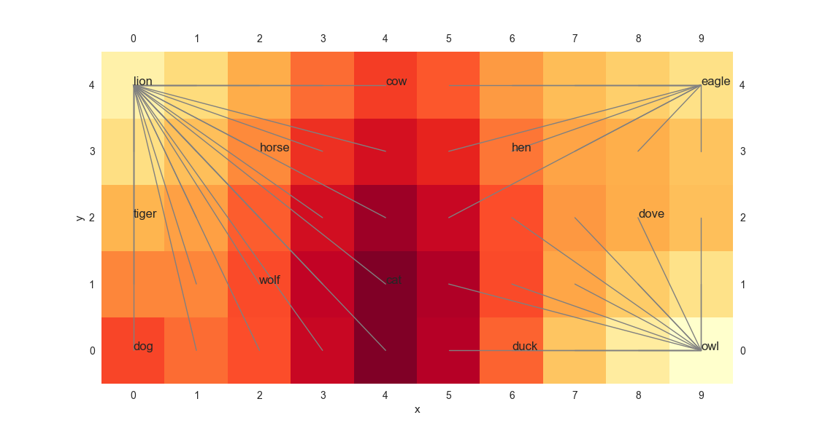
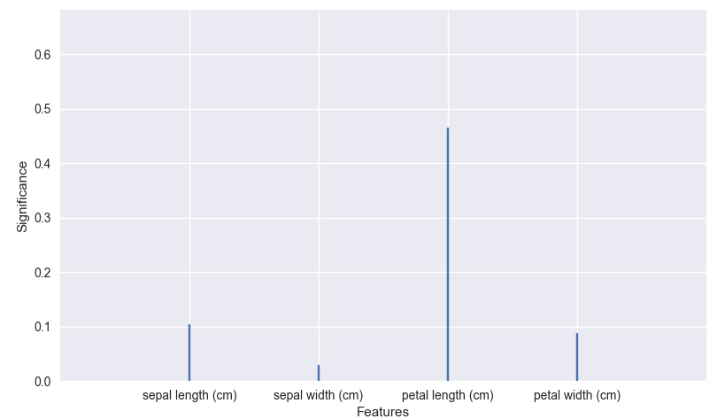
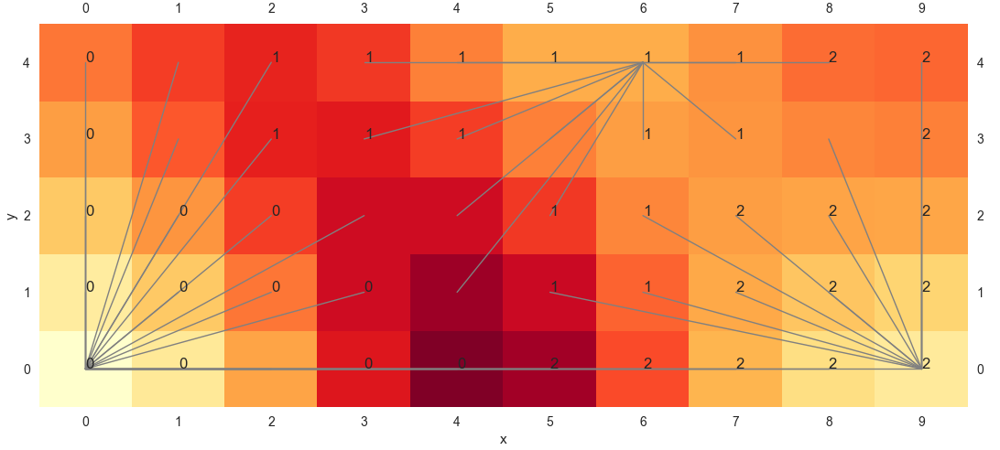
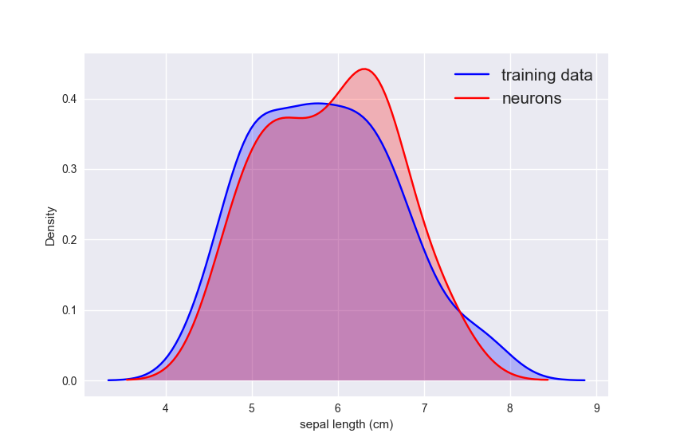
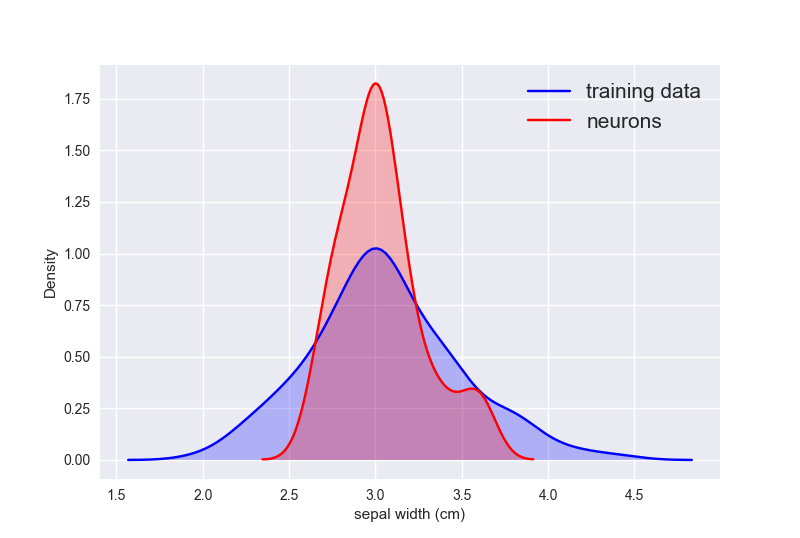
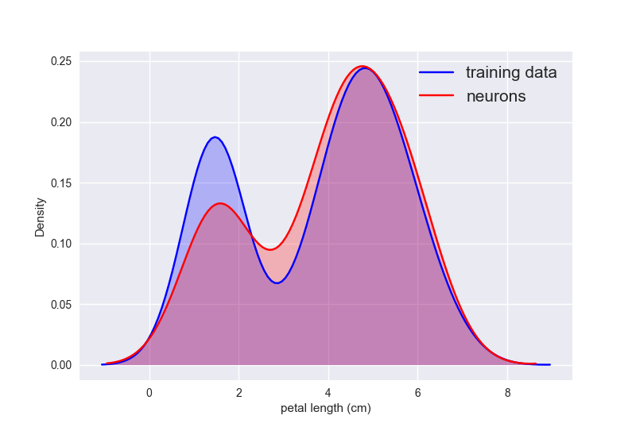
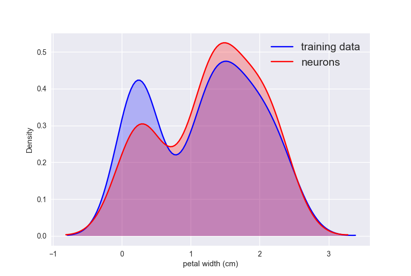

# POPSOM 

POPSOM is a Python library for dealing with population-base Self-Organizing Maps. This work was derived from [R-based POPSOM](https://github.com/lutzhamel/popsom) which developed and maintained by [Dr. Lutz Hamel](https://www.cs.uri.edu/about-us/people/lutz-hamel/) and his former students. 

## Installation

### Requirements
* Python 3.3 and up
* numpy==1.13.1
* pandas==0.20.3
* seaborn==0.7.1
* scikit-learn==0.19.0
* statsmodels==0.8.0
* scipy==0.19.1
* matplotlib==2.0.2

`$ pip install -r requirements.txt`

### How to install
* Copy the popsom.py into python work dict.


## Example 1: Animal data

**We have 13 different kinds of animals with 13 different features.**

|             | dove | hen  | duck | owl  |eagle | dog  | wolf | cat  |tiger | lion |horse | cow  |
| ----------- |:----:| ----:| ----:| ----:| ----:| ----:| ----:| ----:| ----:| ----:| ----:| ----:|
| **Small**   |  1   |  1   |   1  |  1   |  0   |  0   |  0   |  1   |  0   |  0   |  0   |  0   | 
| **Medium**  |  0   |  0   |   0  |  0   |  1   |  1   |  1   |  0   |  0   |  0   |  0   |  0   |
| **Big**     |  0   |  0   |   0  |  0   |  0   |  0   |  0   |  0   |  1   |  1   |  1   |  1   |
| **2 legs**  |  1   |  1   |   1  |  1   |  1   |  0   |  0   |  0   |  0   |  0   |  0   |  0   | 
| **4 legs**  |  0   |  0   |   0  |  0   |  0   |  1   |  1   |  1   |  1   |  1   |  1   |  1   |
| **hair**    |  0   |  0   |   0  |  0   |  0   |  1   |  1   |  1   |  1   |  1   |  1   |  1   |
| **Hooves**  |  0   |  0   |   0  |  0   |  0   |  0   |  0   |  0   |  0   |  0   |  1   |  1   | 
| **Mane**    |  0   |  0   |   0  |  0   |  0   |  0   |  1   |  0   |  0   |  1   |  1   |  0   |
| **Feathers**|  1   |  1   |   1  |  1   |  1   |  0   |  0   |  0   |  0   |  0   |  0   |  0   |
| **Hunt**    |  0   |  0   |   0  |  1   |  1   |  0   |  1   |  1   |  1   |  1   |  0   |  0   | 
| **Run**     |  0   |  0   |   0  |  0   |  0   |  1   |  1   |  0   |  1   |  1   |  1   |  0   |
| **Fly**     |  1   |  0   |   1  |  1   |  0   |  0   |  0   |  0   |  0   |  0   |  0   |  0   |
| **Swim**    |  0   |  0   |   1  |  0   |  0   |  0   |  0   |  0   |  0   |  0   |  0   |  0   | 


**Load popsom, pandas and sklearn libraries.**
```python
import popsom as som  
import pandas as pd
from   sklearn import datasets
```

**Prepare the data for training.**
```python
animal = ['dove','hen','duck','owl','eagle','fox','dog','wolf','cat','tiger','lion','horse','cow']
attribute = [[1,0,0,1,0,0,0,0,1,0,0,1,0],
             [1,0,0,1,0,0,0,0,1,0,0,0,0],
             [1,0,0,1,0,0,0,0,1,0,0,1,1],
             [1,0,0,1,0,0,0,0,1,1,0,1,0],
             [0,1,0,1,0,0,0,0,1,1,0,0,0],
             [0,1,0,1,0,0,0,0,1,1,0,0,0],
             [0,1,0,0,1,1,0,0,0,0,1,0,0],
             [0,1,0,0,1,1,0,1,0,1,1,0,0],
             [1,0,0,0,1,1,0,0,0,1,0,0,0],
             [0,0,1,0,1,1,0,0,0,1,1,0,0],
             [0,0,1,0,1,1,0,1,0,1,1,0,0],
             [0,0,1,0,1,1,1,1,0,0,1,0,0],
             [0,0,1,0,1,1,1,0,0,0,0,0,0]]

attr = pd.DataFrame(attribute)
attr.columns = ['small','medium','big','2 legs','4 legs','hair','hooves','mane','feathers','hunt','run','fly','swim']
```

**Initialize the model.**
```python
m = som.map(xdim=10,ydim=5)
```

**Train the data.**
```python
m.fit(attr,animal)
```

**Compute and display the starburst representation of clusters**
```python
m.starburst()
```



## Example 2: Iris data

**1. Prepare the iris data for training.**

```python
iris 	= datasets.load_iris()
labels 	= iris.target
data 	= pd.DataFrame(iris.data[:, :4])
data.columns = iris.feature_names
```

**2. Initialize the model.**
```python
m = som.map(xdim=10,ydim=5,train=1000,norm=False) 
```

> Parameters:
  - xdim,ydim - the dimensions of the map
  - alpha - the learning rate, should be a positive non-zero real number
  - train - number of training iterations
  - norm - normalize the input data space


**3. Train the data.**
```python
m.fit(data,labels)
```

> Parameters:
  - data - a dataframe where each row contains an unlabeled training instance
  - labels - a vector or dataframe with one label for each observation in data


**4. Compute the relative significance of each feature and plot it**
```python
m.significance()
```

> Parameters:
  - graphics - a switch that controls whether a plot is generated or not
  - feature_labels - a switch to allow the plotting of feature names vs feature indices





**5. Compute the convergence index of a map**
```python
m.convergence()
1.0
```

> parameters:
  - k - the number of samples used for the accuracy computation
  - conf_int - the confidence interval of the accuracy test (default 95%)
  - verb - switch that governs the return value, false: single accuracy value is returned, true: a vector of individual feature accuracies is returned.
  - interval - a switch that controls whether the confidence interval is computed.
			
> Return:
  - return value is the estimated topographic accuracy.


**6. Evaluate the embedding of a map using the F-test and a Bayesian estimate of the variance in the training data**
```python
m.embed()
1.0
```

> Parameters:
  - conf_int - the confidence interval of the convergence test (default 95%)
  - verb - switch that governs the return value false: single convergence value is returned, true: a vector of individual feature congences is returned.
			
> Return value:
  - return is the cembedding of the map (variance captured by the map so far)

> Hint: 
  - the embedding index is the variance of the training data captured by the map;
  - maps with convergence of less than 90% are typically not trustworthy.  
  - Of course, the precise cut-off depends on the noise level in your training data.


**7. Measure the topographic accuracy of the map using sampling**
```python
m.topo()
{'val': 0.97999999999999998, 'lo': 0.93999999999999995, 'hi': 1.0}
```

> Parameters:
  - conf_int - the confidence interval of the quality assessment (default 95%)
  - k - the number of samples used for the estimated topographic accuracy computation
  - verb - if true reports the two convergence components separately, otherwise it will report the linear combination of the two
  - ks - a switch, true for ks-test, false for standard var and means test
			
> Return:
  - return value is the convergence index


**8. Compute and display the starburst representation of clusters**
```python
m.starburst()
```

> Parameters:
  - explicit - controls the shape of the connected components
  - smoothing - controls the smoothing level of the umat (NULL,0,>0)
  - merge_clusters - a switch that controls if the starburst clusters are merged together
  - merge_range - a range that is used as a percentage of a certain distance in the code to determine whether components are closer to their centroids or centroids closer to each other.



**9. Plot that shows the marginal probability distribution of the neurons and data**
```python
m.marginal(0)
m.marginal(1)
m.marginal(2)
m.marginal(3)
```

> Parameters:
  - marginal is the name of a training data frame dimension or index


<p float="left">
  
   
</p>

<p float="left">
  
   
</p>

**10. Print the association of labels with map elements**
```python
m.projection()
     labels  x  y
0         0  9  2
1         0  8  0
2         0  9  1
3         0  8  0
4         0  9  2
5         0  8  4
6         0  8  1
..      ... .. ..
141       2  0  2
142       2  2  4
143       2  0  1
144       2  0  4
145       2  0  2
146       2  2  2
147       2  1  2
148       2  0  4
149       2  2  4
```

> Return:
  - a dataframe containing the projection onto the map for each observation.


**11. Returns the contents of a neuron at (x,y) on the map as a vector**
```python
m.neuron(6,3)
array([ 5.21176518,  2.61068045,  3.63423014,  1.18464818])
```

> Parameters:
  - x - map x-coordinate of neuron.
  - y - map y-coordinate of neuron.
		
> Return:
  - a vector representing the neuron.


## Reference Thesis
[Yuan, Li](mailto:li_yuan@my.uri.edu), "[Implementation of Self-Organizing Maps with Python](https://digitalcommons.uri.edu/theses/1244)" (2018).

## License
[MIT](https://choosealicense.com/licenses/mit/)
